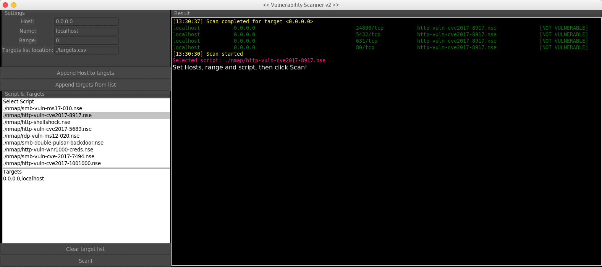

***
Download NSE scripts here: https://nmap.org/nsedoc/lib/nmap.html

Application requires VULNERABLE or LIKELY VULNERABLE in the script.

You can also import targets from a CSV file.

Importing a CSV file removes the first item in the list, because in my example file its a header.

Valid ranges (examples) are: 21, 21-80 or 0 (0 = no range/port on the UI version, leave range blank on the console version.)

***
# CHANGE LOG
Version format: [major].[minor].[build]

- - - -
# Version 2.0.2 (17-02-2019)
### Features
**[ ADDED ]** New GUI design and included themes for a nicer look. Minor bug fixes and improvements. Application now has a login screen, username and password = root.

### Known present Issues
**[!]** The application freezes when you start the scan until finished. (This does not happen in the supplied console version)

- - - -
# Version 1.0.1 (18-04-2018)
### Features
**[ ADDED ]** New version has a GUI for easy use. Set targets, port range, select script and click "Scan".
Valid ranges examples are 21, 21-80 or 0 (0 = no range/port)

### Known present Issues
**[!]** The application freezes when you start the scan until finished. (This does not happen in the supplied console version)

# Version 0.3.2 (24-04-2017)
### Features
**[ ADDED ]** Script will now search for '.nse' script in the application root directory. You can select any found script by number, none or use all.

### Known present Issues
**[!]** Selecting "ALL" scripts isn't working, yet.

**[!]** When no '.nse' file was given, it will print 'NOT VULNERABLE' during a normal scan.

- - - -
# Version 0.2.1 (20-04-2017)
### Bug fix
**[ FIXED ]** In some cases the application would say 'NOT VULNERABLE', though they are.

### Features
**[ CHANGE ]** Scans should now ignore closed and filtered ports

**[ ADDED ]** Set a port or range to scan (3389 or 3389-5400)

### Known Issues
**[!]** When no '.nse' file was given, it will print 'NOT VULNERABLE' during a normal scan.
> Note: Since it doesn't break the core, it has low priority
- - - -

# Version 0.1.1 (19-04-2017)
Alpha test - More of a concept than practical
> Note: this version is unstable and gives false positives!
